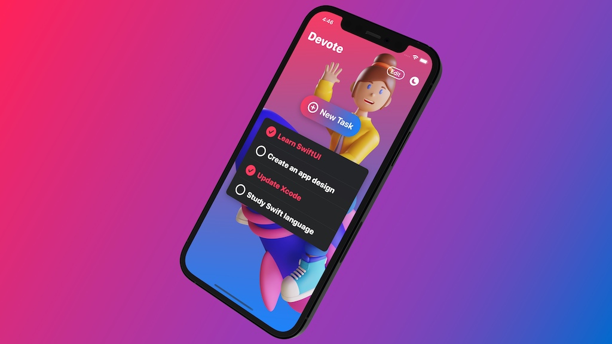
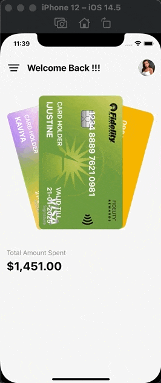
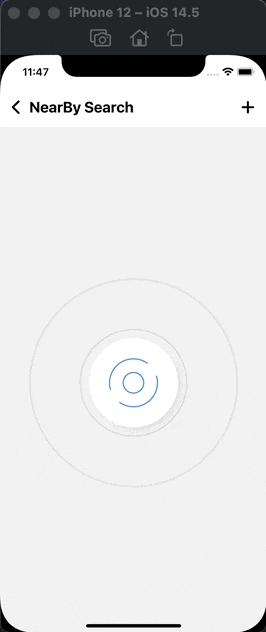
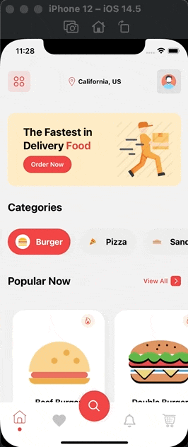
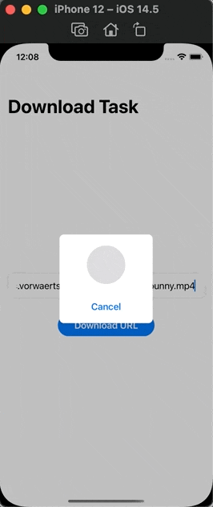
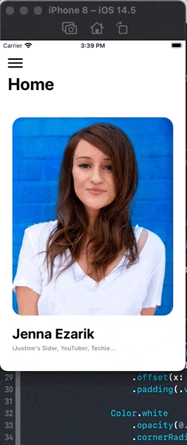
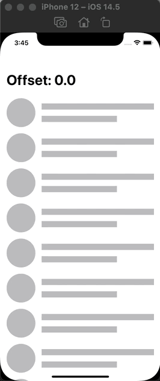
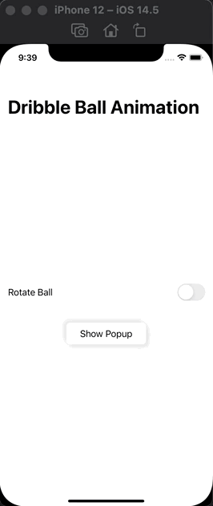

# kavsoft-examples

## Introduction

All demos in this repo were written by SwiftUI 2.0. The only purpose of this repo I created is just for learning SwiftUI and comminications. All of Business incomes and Copyrights belong to Kavsoft at [Home|Kavsoft](https://kavsoft.dev).

Kindly welcome to become a patron to support them! ❤️

## Example apps

- Scroll To Top Floating Action Button

  Reference resoure: [Scroll To Top Floating Action Button|Kavsoft](https://kavsoft.dev/SwiftUI_2.0/Scroll_To_Top)

  

- Custom Carousel Slider

  Reference resoure: [Custom Carousel Slider|Kavsoft](https://kavsoft.dev/SwiftUI_2.0/Custom_Carousel_Slider)

  

  

- Photo Editor

  Reference resource: [Photo Editor|kavsoft](https://kavsoft.dev/SwiftUI_2.0/Photo_Editor)

  

- Spotify App UI

  Reference resource: [Spotify App UI|kavsoft](https://kavsoft.dev/SwiftUI_2.0/Spotify_App_UI)

  
  
- Mobile Wallet Card Animation

  Reference resource: [Mobile Wallet Card Animation|kavsoft](https://kavsoft.dev/SwiftUI_2.0/Wallet_Card_Animation)

  

- Pulse Ring Animation

  Reference resource: [Pulse Ring Animation|kavsoft](https://kavsoft.dev/SwiftUI_2.0/Pulse_Ring_Animation)

  

- Food App UI - Complex UI

  Reference resource: [Food App UI - Complex UI|kavsoft](https://kavsoft.dev/SwiftUI_2.0/Food_App_UI)

  

- SwiftUI URL Session Download Task

  Reference resource: [SwiftUI URL Session Download Task|Kavsoft](https://kavsoft.dev/SwiftUI_2.0/Download_Task)

  

- Animated Navigation Menu

  Reference resource: [Animated Navigation Menu|Kavsoft](https://kavsoft.dev/SwiftUI_2.0/Animated_Navigation_Menu)

  

- ScrollView Offset

  Reference resource: [ScrollView Offset|Kavsoft](https://kavsoft.dev/SwiftUI_2.0/ScrollView_Offset)

  

- WhatsApp Hero Animation

  Reference resource: [WhatsApp Hero Animation|Kavsoft](https://kavsoft.dev/SwiftUI_2.0/WhatsApp_Hero_Animation)

  

- Dribble Loading Screen

  Reference resource: [Dribble Loading Screen|Kavsoft](https://kavsoft.dev/SwiftUI_2.0/Dribbble_Loading_Screen)

  

